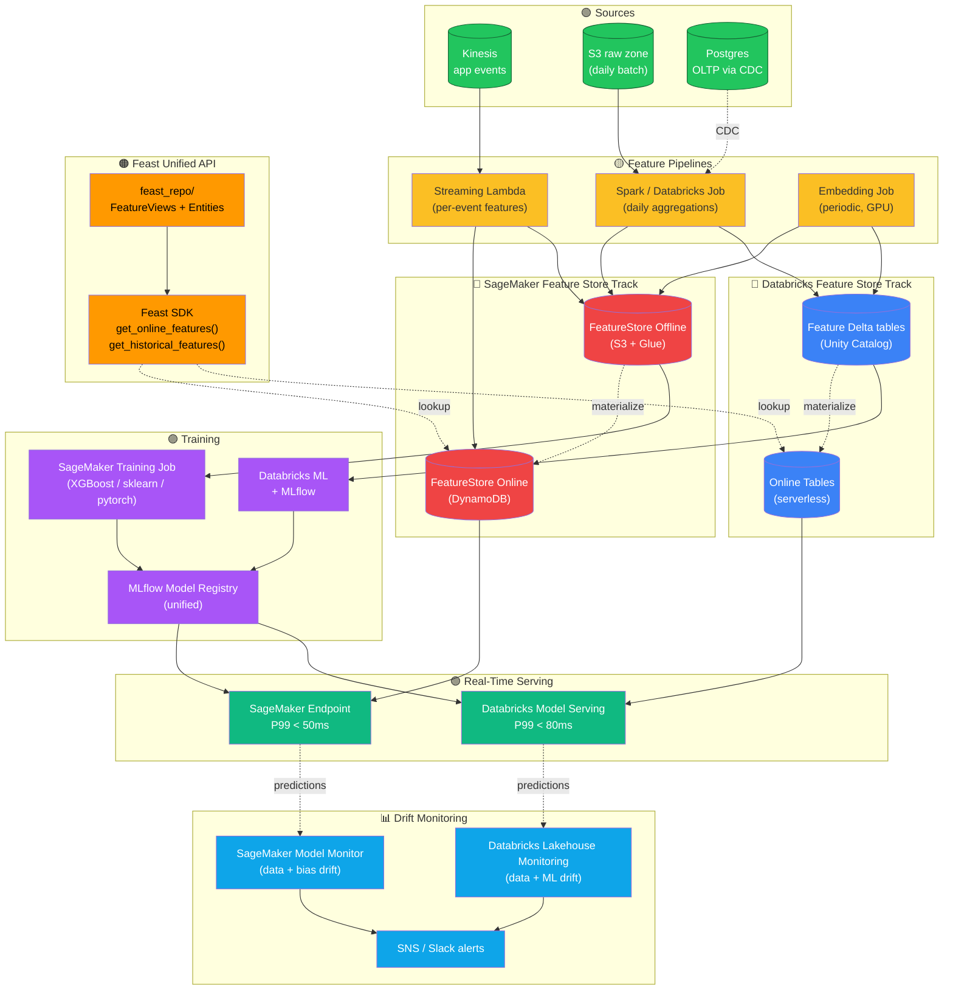
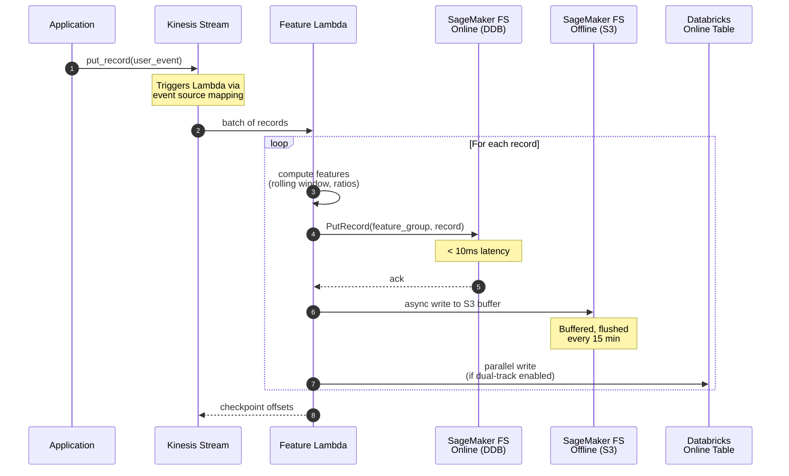
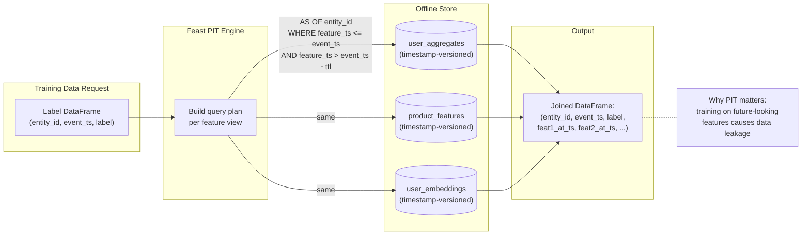
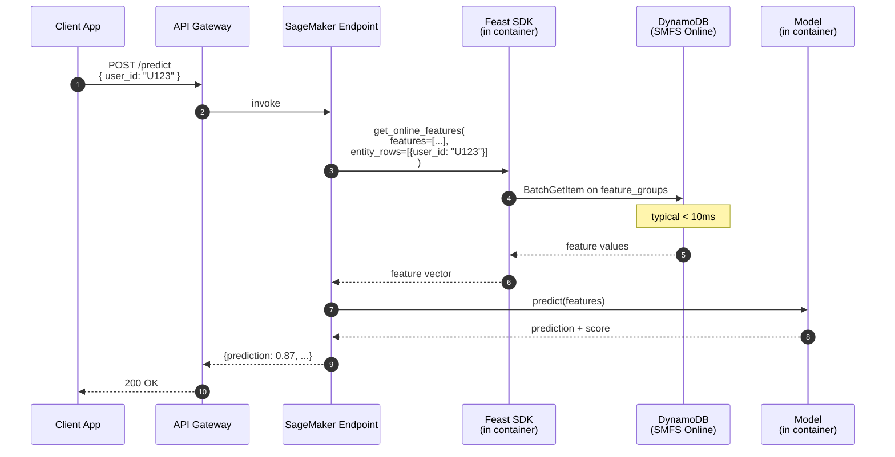
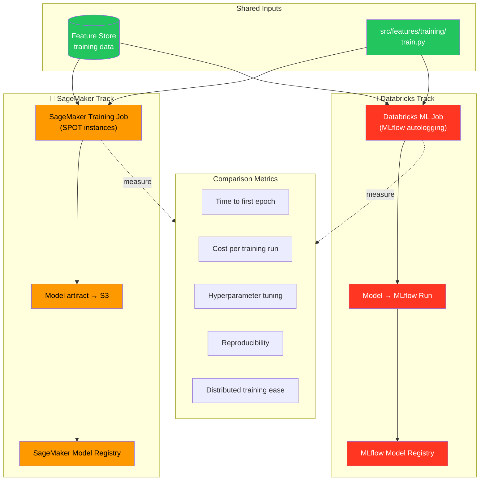
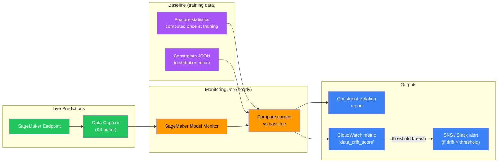
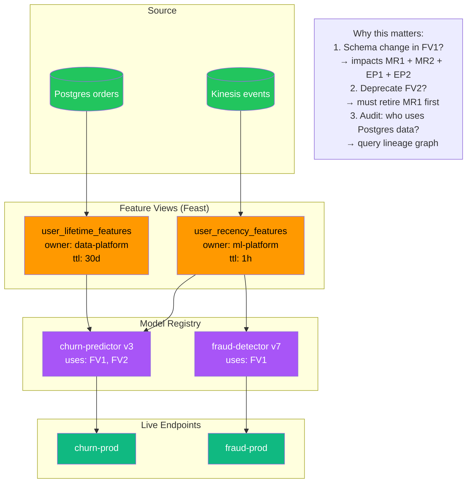
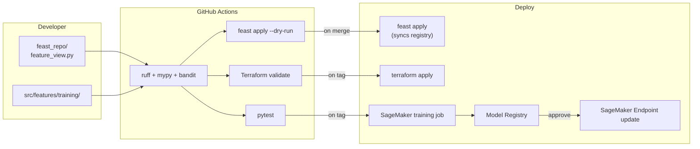

# AWS SageMaker + Databricks Feature Store

> Production-grade feature platform with **SageMaker Feature Store** and **Databricks Feature Store** running side-by-side, unified by **Feast** as the abstraction layer. Streaming features (Kinesis → DynamoDB online + S3 offline), batch features (Spark on EMR/Databricks), training (SageMaker + Databricks ML), real-time serving (SageMaker endpoints + Databricks Model Serving), and continuous drift monitoring (SageMaker Model Monitor + Databricks Lakehouse Monitoring).

[](https://github.com/sushmakl95/aws-sagemaker-databricks-feature-store/actions/workflows/ci.yml)
[](https://www.python.org/)
[](https://spark.apache.org/)
[](https://aws.amazon.com/sagemaker/feature-store/)
[](https://www.databricks.com/)
[](https://feast.dev/)
[](https://mlflow.org/)
[](https://www.terraform.io/)
[](LICENSE)

---

## Author

**Sushma K L** — Senior Data Engineer
📍 Bengaluru, India
💼 [LinkedIn](https://www.linkedin.com/in/sushmakl1995/) • 🐙 [GitHub](https://github.com/sushmakl95) • ✉️ sushmakl95@gmail.com

---

## What this platform does

You're building ML models that need:

1. **Consistent features online + offline** — same logic for training and inference, no skew
2. **Streaming + batch features** — recent behavior (last 5 min) and historical (last 90 days), unified
3. **Sub-10ms online lookup** for real-time inference
4. **Drift detection** — alert when input distribution shifts from training data
5. **Cross-platform portability** — train on SageMaker, serve on Databricks, or vice versa

This repo delivers all five with two interchangeable backends (SageMaker Feature Store + Databricks Feature Store), one unified API (Feast), and full observability.

## Comparison at a glance

| Capability | SageMaker Feature Store | Databricks Feature Store | Feast (unified) |
|---|---|---|---|
| Online store | DynamoDB-backed (managed) | Online Tables on Delta + Lakehouse | Configurable: DynamoDB, Redis, etc. |
| Offline store | S3 + Glue catalog | Delta Lake + Unity Catalog | Configurable: S3, BigQuery, etc. |
| Point-in-time joins | ✅ via Athena | ✅ native | ✅ via configured offline store |
| Streaming ingest | ✅ via PutRecord API | ✅ via DLT + Online Tables | ✅ via push API |
| Batch ingest | ✅ via SageMaker Processing | ✅ via Spark MERGE | ✅ via materialize |
| Training integration | ✅ SageMaker Training | ✅ Databricks ML | ✅ via to_dataframe |
| Serving integration | ✅ SageMaker Endpoint | ✅ Model Serving | Manual lookup |
| Cost (baseline) | ~$300/month | ~$200/month (already on Databricks) | $0 (just abstraction) |

We expose all three so teams pick what fits.

---

## System Architecture

### High-level architecture



### Streaming feature ingest sequence



### Point-in-time correct training data



### Real-time inference path



### SageMaker vs Databricks training comparison



### Drift detection architecture



### Feature lineage + governance



### Deployment + CI/CD



---

## Repository Structure

```
aws-sagemaker-databricks-feature-store/
├── .github/workflows/          # CI: lint + TF validate + feast apply dry-run + tests
├── src/
│   ├── features/
│   │   ├── core/               # FeatureView, Entity, FeatureValue types
│   │   ├── sources/            # Kinesis, S3, Postgres source readers
│   │   ├── sinks/              # SageMaker FS + Databricks FS sinks
│   │   ├── transforms/         # Aggregation + embedding transforms
│   │   ├── registry/           # Feast registry sync helpers
│   │   ├── serving/            # Inference helpers
│   │   ├── training/           # Training script (sklearn/xgboost/pytorch)
│   │   ├── monitoring/         # Drift detection helpers
│   │   └── utils/              # Logging, secrets, Spark
│   ├── feast_repo/             # Feast feature_views + entities + data sources
│   └── lambdas/                # Streaming feature pipeline + monitoring
├── notebooks/                  # Databricks notebooks (training + DLT FE)
├── infra/terraform/
│   ├── modules/                # 17 modules
│   └── envs/                   # dev/staging/prod
├── dashboards/                 # Grafana + CloudWatch JSON
├── scripts/                    # feast apply, deploy endpoint, drift check
├── tests/                      # Unit + integration
├── config/                     # Feature view definitions, monitor configs
└── docs/
    ├── ARCHITECTURE.md
    ├── FEATURE_AUTHORING.md
    ├── POINT_IN_TIME_JOINS.md
    ├── ONLINE_OFFLINE_PARITY.md
    ├── MODEL_MONITORING.md
    ├── LOCAL_DEVELOPMENT.md
    ├── COST_ANALYSIS.md
    ├── RUNBOOK.md
    └── SAGEMAKER_VS_DATABRICKS.md
```

## Quick Start

```bash
git clone https://github.com/sushmakl95/aws-sagemaker-databricks-feature-store.git
cd aws-sagemaker-databricks-feature-store
make install-dev
make compose-up               # Local stack: Kinesis (LocalStack) + Postgres + Redis
make demo-streaming-features  # Computes streaming features locally
make demo-training            # Trains a model on synthetic features
```

## ⚠️ Cloud Cost Warning

Production deployment costs approximately **$1,200/month** at moderate inference throughput (1K predictions/sec). See [docs/COST_ANALYSIS.md](docs/COST_ANALYSIS.md). For evaluation, use the local Docker stack.

## Resume Alignment

- **Current (JLP)**: "PDP Sell team — feature engineering for clickstream models"
- **Equal Experts**: "Designed and operationalized ML feature pipelines on GCP"
- **Publicis Sapient / Goldman Sachs**: "Databricks lakehouse with MLflow model registry"

## License

MIT — see [LICENSE](LICENSE).
